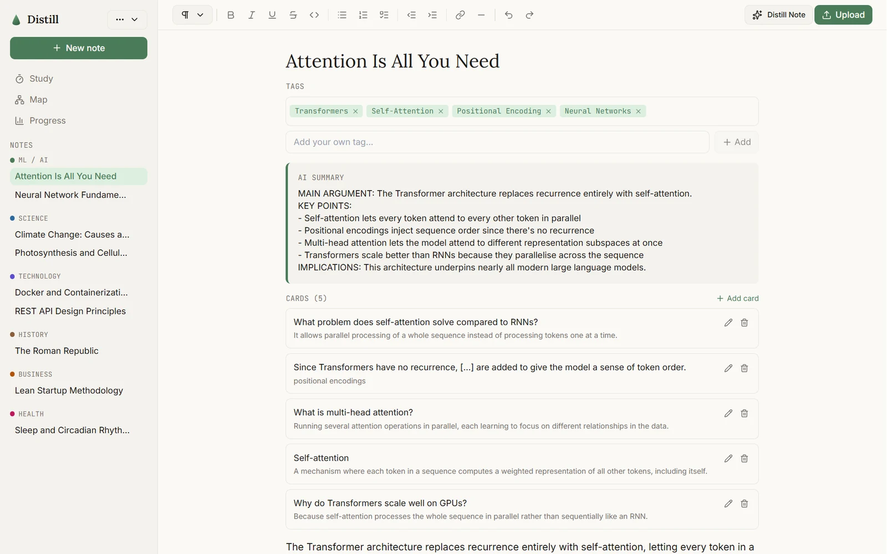
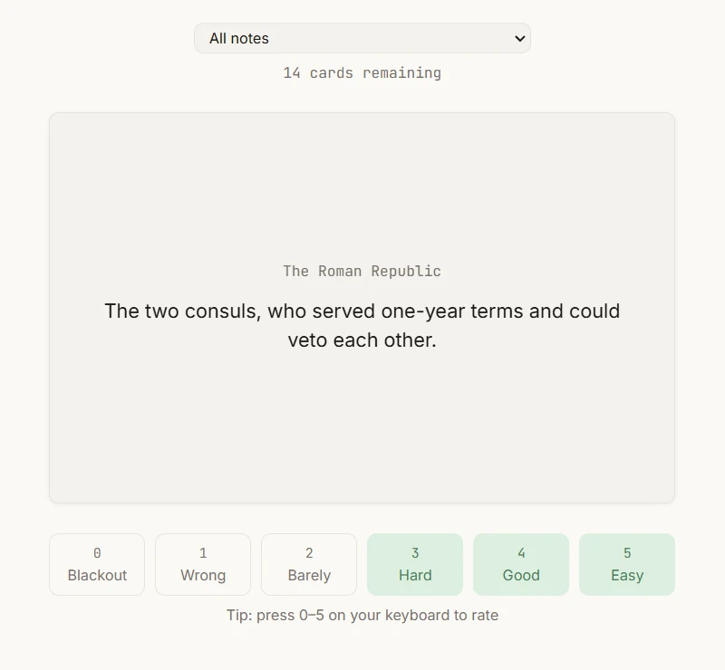
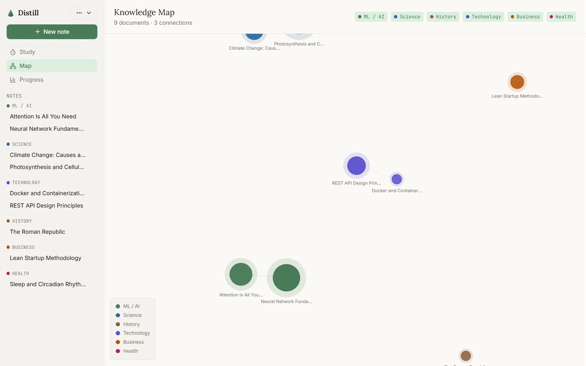
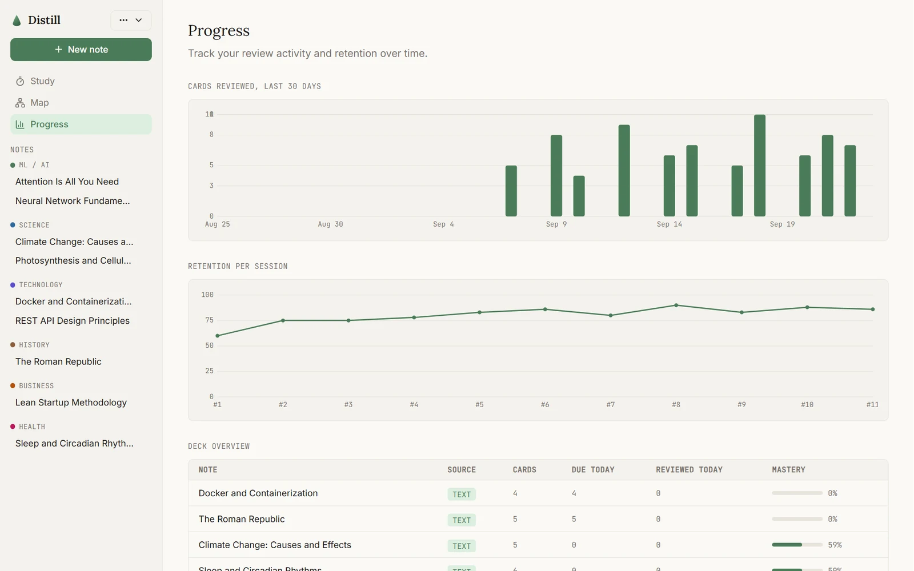

# Distill

**[Try it live](https://distill-study.vercel.app)**

Distill is a study app that turns anything you read into something you'll actually remember. Write a note or drop in a PDF, a Word document, an EPUB or a web link, and it gives you back a short summary, a set of flashcards and a place on a map of everything else you've studied. The flashcards then come back on a spaced repetition schedule, just before you'd forget them.

It was my MSc Computer Science dissertation at the University of Lincoln (June to August 2026), designed, built and evaluated on my own.




---

## The problem

Most of what we read is gone within a few days. Flashcards and spaced repetition fix that, but making good cards by hand takes so long that most people never do it. And once you have hundreds of notes, it's hard to see how any of them relate to each other.

I wanted one place where you just write or upload, and the boring part (summarising, making cards, remembering to review) happens for you.

---

## What I built

- **Notes that do the work for you.** Every note gets a summary, tags and a set of flashcards from Claude, shown above your own writing so nothing is hidden away.
- **Upload almost anything.** PDFs, Word files, EPUBs, plain text and web articles are turned into text in the browser.
- **Study mode with honest ratings.** Six ratings from "blackout" to "easy" feed an SM-2 schedule, and keyboard shortcuts (0 to 5) are shown right under the buttons.
- **A knowledge map.** A force-directed graph links related notes and colours them by subject, so you can see what you know and where the gaps are.
- **Progress you can trust.** Cards reviewed over 30 days, retention over time and mastery per deck, drawn with small hand-built SVG charts.
- **Local first.** Everything is stored on your own device in IndexedDB. There's no account and nothing to sign up for, and it installs as an app.

---

## Design decisions

### Redesigning halfway through
The first version was a normal multi-page app: separate Upload, Cards, Study, Progress and Map pages behind a top bar. Partway through the build I realised that fought against how people actually work, which is inside their notes. So I rebuilt the structure around one persistent sidebar and a writing canvas, a lot closer to Notion. It was a bigger change than I wanted to make that late, but it was the right call.

### Evidence over instinct
I ran a heuristic evaluation across all five core flows using Nielsen's ten usability heuristics and found 11 issues, rated by severity. Two examples: the progress page showed a 71% "mastery" score for notes with no reviewed cards, and there was no way to delete a note at all. All 11 were fixed and re-checked in the running app.

A separate pass where I tried to break the app on purpose found a stored XSS hole: pasted rich content went into the page without being cleaned. It's fixed with plain-text paste handling, plus DOMPurify as a second layer.

### Performance shaped the design
Lighthouse showed the Progress page was the only one missing its performance target. The charting library was 110KB of gzipped JavaScript for two simple charts, so I replaced it with a small SVG chart component. That cut the page's script weight by 98% and lifted its score from 85 to 92.

### Measuring the AI, not just the interface
"The AI works" needed a number behind it, so I built a ROUGE benchmark over 20 documents (three subjects, three lengths) that scores Claude's summaries against reference summaries. The results are in `benchmark/results/`.

---

## How the hosted demo keeps its key safe

Distill calls Claude straight from the browser, which is fine locally with your own key. For the public demo that would mean shipping my key in the JavaScript, so the hosted version sends requests to a tiny serverless function instead (`api/anthropic.ts`). The function adds the key on the server, only allows the two models the app uses, caps output length and slows down anyone sending far more requests than a person studying would.

---

## Stack

| Layer | Technology |
|---|---|
| Framework | React 18 with Vite |
| Language | TypeScript |
| Styling | Tailwind with CSS custom properties as design tokens |
| Storage | Dexie on top of IndexedDB |
| AI | Claude API (Sonnet for analysis, Haiku for finding connections) |
| Map | D3 force simulation |
| Files | pdf.js, Mammoth, epub.js, Readability |
| Offline | Workbox service worker, installable PWA |
| Testing | Vitest, Lighthouse, a ROUGE benchmark |

---

## Running it locally

```bash
git clone https://github.com/Cole-Crawley/distill.git
cd distill
npm install
```

Create a `.env` file with your own Claude API key (get one at [console.anthropic.com](https://console.anthropic.com)):

```env
VITE_ANTHROPIC_API_KEY=your_key_here
```

You can also leave it out and paste a key into Settings inside the app.

```bash
npm run dev      # start the app
npm test         # run the tests
```

Open [http://localhost:5173](http://localhost:5173).

---

## Project structure

```
api/
  anthropic.ts        Server-side relay used by the hosted demo
benchmark/            ROUGE benchmark and Lighthouse results
src/
  pages/              Home, note editor, study, map and progress
  features/
    notes/            Editor, toolbar, slash menu, sources
    upload/           File and link extractors
    study/            Flashcards and rating buttons
    knowledge-map/    D3 graph
    progress/         Charts and deck stats
  lib/                AI adapter, SM-2 scheduling, database, settings
  sw.ts               Service worker for offline use
```

---

## Screenshots

Studying a card, with the six ratings and their keyboard shortcuts:



The knowledge map, coloured by subject:



The progress page, drawn with hand-built SVG charts:



---

## What I took away from it

The biggest lesson was that the problems that matter only show up when you use the real thing. Neither the misleading mastery score nor the XSS hole would have been caught by type checking or a quick click-through. Testing against real use, and being willing to change the structure when the evidence says so, made far more difference than any single feature.

*Built by [Cole Crawley](https://colecrawley.com) for an MSc in Computer Science at the University of Lincoln.*
